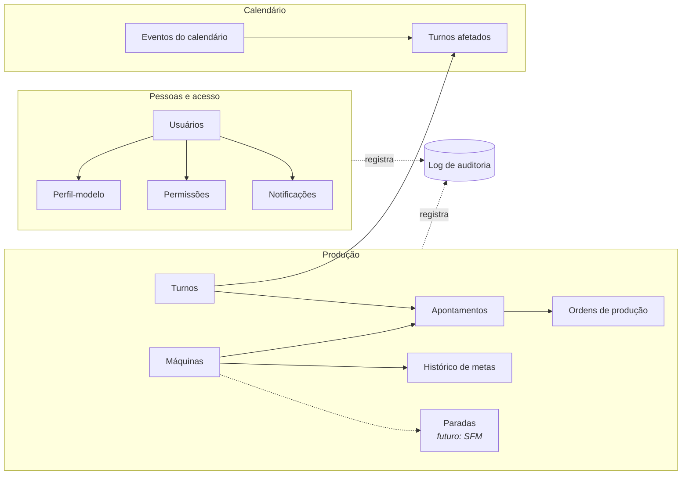
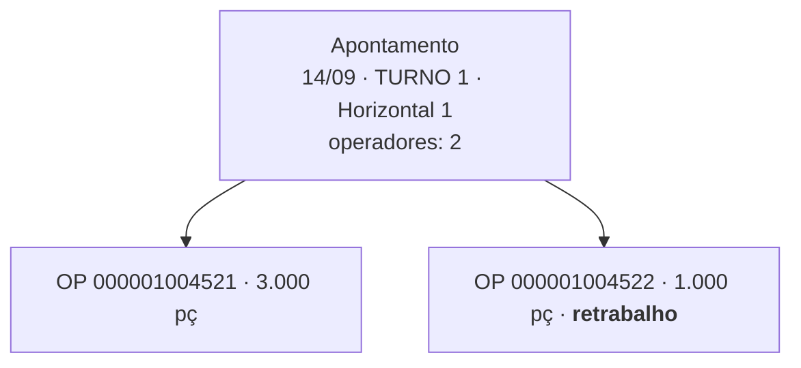
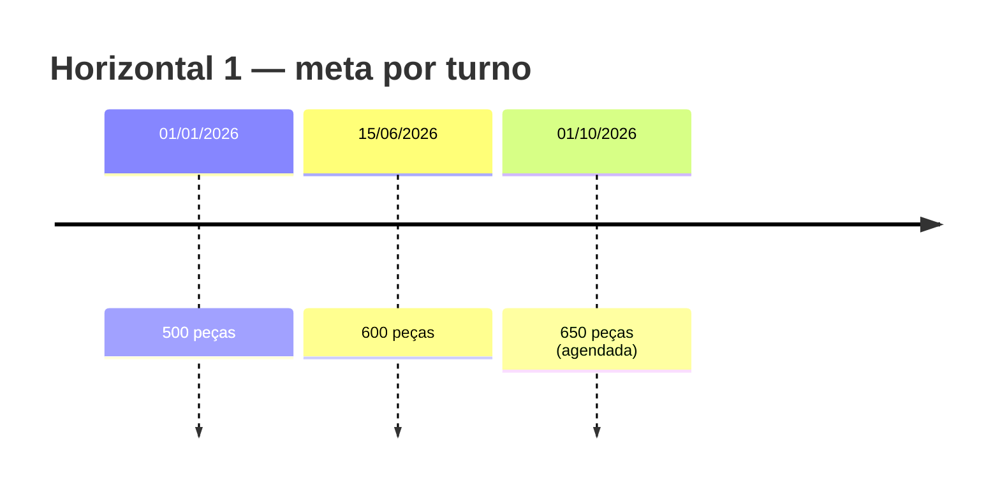
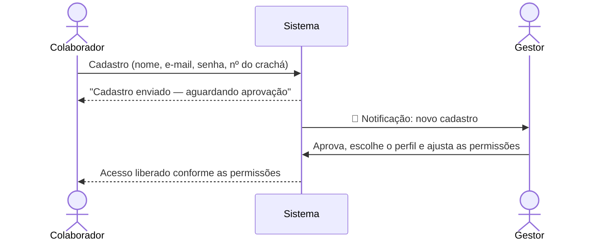

# Visão Geral do Banco de Dados

> Versão do schema: `v0.2.2` · Última atualização: 16/09/2026 · Documento em linguagem simples, para apresentação.
> Detalhes técnicos: [02-referencia-tecnica.md](02-referencia-tecnica.md)

## 1. Por que um banco novo

O Dash de Produção nasceu sobre planilhas do Google Sheets. Elas funcionaram, mas têm limites que
aparecem com o tempo:

| Na planilha | No banco novo |
|---|---|
| Qualquer célula aceita qualquer coisa ("500", "quinhentos", "-50") | Cada coluna tem tipo e regra; o banco recusa dado inválido |
| Nada liga uma aba à outra; dá para apontar na "máquina 99" | Ligações reais: só existe apontamento de máquina cadastrada |
| Nome da máquina copiado em várias abas | Cada informação mora em um lugar só |
| Meta sobrescrita: o histórico se perde | Toda meta fica guardada com a data em que passou a valer |
| Para achar algo, o sistema lê a planilha inteira | Índices levam direto à informação, mesmo com anos de dados |
| Retrabalho somado junto com a produção | Produção boa e retrabalho separados |

## 2. O mapa geral

## 3. Como funciona o apontamento

Um **apontamento** é: *"a máquina X, no dia Y, no turno Z, produziu estas ordens de produção"*.

- Existe **um apontamento por máquina + dia + turno + tipo de trabalho** (normal ou hora extra). Se alguém apontar algo que já existe, o sistema
  completa o apontamento existente em vez de criar outro.
- Apontar **atrasado** é permitido.
- Uma **ordem de produção (OP)** pode ser dividida entre turnos: o 1º turno faz uma parte, o 2º completa.
- Qualquer pessoa pode apontar qualquer turno. O sistema sempre registra **quem** apontou.
- **Hora extra** (esporádica, combinada com o gestor) é apontada no turno em que ocorreu, mas **marcada como tal**: entra na produção total e num indicador próprio, e fica fora do cálculo de atingimento de meta — medir poucas horas com a meta de um turno inteiro daria um percentual falso. [D27]

## 4. Produção boa × retrabalho

Retrabalho é esforço da máquina, **não** produção nova. Se a máquina fez 4.000 peças e depois refez
as mesmas 4.000, ela entregou 4.000, e não 8.000.

| Indicador | Cálculo | Exemplo (meta 5.000) |
|---|---|---|
| Produção boa | ordens sem retrabalho | 4.000 |
| Retrabalho | ordens com retrabalho | 4.000 |
| Carga da máquina | boa + retrabalho | 8.000 |
| **Atingimento da meta** | produção boa ÷ meta | **80%** |
| Taxa de retrabalho | retrabalho ÷ carga | 50% |

## 5. Operadores: produção com contexto

Cada máquina tem uma **lotação padrão** (ex: 2 operadores). No apontamento, o campo "Operadores"
já vem preenchido com esse padrão e só é alterado se o turno teve gente a mais ou a menos.

| | Sem contexto | Com lotação |
|---|---|---|
| Operadores | — | 1 de 2 (50%) |
| Meta | 4.000 | ajustada: 2.000 |
| Produção | 2.100 | 2.100 |
| Resultado | 52% 🔴 | **105%** 🟢 |

> A meta ajustada supõe produção proporcional ao número de pessoas. É um indicador de contexto,
> não uma verdade exata.

## 6. Metas com histórico

A meta nunca é sobrescrita. Mudar a meta = adicionar uma nova, com a data em que passa a valer.

- A meta é a mesma para todos os turnos.
- Uma meta nova **não pode começar no passado**. Correções em apontamentos antigos são feitas pelo gestor, um a um.
- Cada apontamento guarda uma "foto" da meta do dia, para o passado nunca mudar sozinho.

## 7. Calendário: feriados, eventos e dias anulados

| Tipo | Exemplo | Efeito no dashboard |
|---|---|---|
| Feriado | Natal, aniversário da cidade, férias coletivas | Contexto (etiqueta) |
| Evento especial | Jogo da Copa, SIPAT | Contexto (etiqueta) |
| Dia anulado | Falta de energia, parada geral | **Sai dos cálculos** |

- Um evento pode afetar **o dia inteiro** ou **só alguns turnos** (ex: jogo às 16h afeta só o 2º turno).
- Pode haver **vários eventos no mesmo dia**. Se um deles for "dia anulado", ele prevalece.
- Os **feriados nacionais** serão importados automaticamente todo ano; estaduais, municipais e da
  empresa são cadastrados pelo gestor.

## 8. Cadastro e aprovação de usuários

### Perfis (modelos de permissão)

| Perfil | Pode |
|---|---|
| Operador | Apontar e corrigir os próprios apontamentos por 24 h |
| Preparador | + histórico, feedbacks, editar e apagar **um por vez** |
| Distribuidor | + editar e apagar **vários de uma vez**, exportar relatórios |
| Técnico | + dashboard, metas (ver), máquinas, calendário, alertas, modo TV |
| Gestor | Acesso total, incluindo alterar metas e aprovar usuários |
| Admin | Acesso total, em conta compartilhada com identificação por crachá a cada sessão |
| TV | Só o modo TV |

O perfil é um **ponto de partida**: o gestor pode marcar ou desmarcar permissões individualmente.
As permissões são impostas **pelo próprio banco**, não apenas escondidas na tela.

## 9. Rastreabilidade

Toda alteração em produção, metas, máquinas, calendário, usuários e permissões fica registrada
automaticamente: **quem**, **quando**, **de onde** (IP), **como estava antes** e **como ficou**.
Nem o Admin consegue apagar esse registro.

## 10. Preparado para o futuro

| Integração | O que já está pronto |
|---|---|
| **SFM** (chão de fábrica) | Tabela de paradas de máquina com código de origem, sem duplicar importações |
| **SAP** (OPs de PCP/Logística) | Número da OP guardado como texto, preservando zeros à esquerda |
| **Banco da WEG** | Nomes em inglês, sem acentos, tipos padrão — tradução direta |
