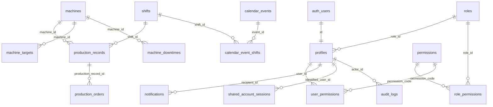

# Referência Técnica do Schema

> Versão do schema: `v0.4.0` · Última atualização: 20/09/2026 · Status: **em implementação** (tabelas criadas marcadas com ✅)
> SGBD: PostgreSQL (Supabase) · Schema: `public` (+ `auth`, gerenciado pelo Supabase)
> Decisões citadas como `[Dxx]` estão em [03-decisoes.md](03-decisoes.md).

## 1. Convenções

| Item | Regra |
|---|---|
| Identificadores | inglês, `snake_case`, sem acentos |
| Tabelas | plural (`machines`) |
| Chave estrangeira | `<entidade_singular>_id` (`machine_id`) |
| Timestamps | `timestamptz`, sufixo `_at`, preenchidos por `default now()` / trigger |
| Datas puras | `date`, sem sufixo de tempo; exibição `dd/mm/aaaa` é responsabilidade do frontend |
| Domínios fechados | `text` + `CHECK (col IN (...))`, sem `ENUM` (portabilidade e evolução) |
| Autoria | `created_by` / `updated_by` → `profiles(id)` |
| Chaves primárias | `uuid default gen_random_uuid()` para dados; `smallint`/`integer identity` para catálogos; `bigint identity` para log |
| Fuso de negócio | `America/Sao_Paulo` em toda regra que dependa de "hoje" (o servidor roda em UTC) |

## 2. Diagrama ER

Colunas de autoria (`created_by`, `updated_by`, `granted_by`, `approved_by`) → `profiles` omitidas do diagrama.

## 3. Dicionário de dados

Legenda: **PK** chave primária · **FK** chave estrangeira · **NN** not null · **UQ** unique.

### 3.1 `machines`
| Coluna | Tipo | Restrições | Descrição |
|---|---|---|---|
| `id` | `integer` | PK, `generated always as identity` | [D01] |
| `name` | `text` | NN; UQ em `lower(name)` | [D02] |
| `has_target` | `boolean` | NN, default `true` | Participa do cálculo de meta |
| `status` | `text` | NN, default `'active'`, CHECK `active`/`inactive`/`maintenance`/`preventive_maintenance` | [D05] |
| `status_updated_at` | `timestamptz` | | Última mudança de status |
| `standard_operator_count` | `smallint` | CHECK `>= 0` | Lotação padrão [D12] |
| `created_by`, `updated_by` | `uuid` | FK `profiles` | [D04] |
| `created_at`, `updated_at` | `timestamptz` | NN, default `now()` | |

Exclusão física bloqueada por FK quando houver produção; desativar via `status`.

### 3.2 `shifts` ✅ implementada em 16/09/2026
| Coluna | Tipo | Restrições | Descrição |
|---|---|---|---|
| `id` | `smallint` | PK | 1, 2, 3 |
| `name` | `text` | NN, UQ, CHECK não vazio | "TURNO 1" |
| `start_time`, `end_time` | `time` | | Turno 3 atravessa a meia-noite (`end_time < start_time`) |
| `is_active` | `boolean` | NN, default `true` | Substitui `localStorage.turnosAtivos` [D06] |

> **Regra: `start_time`/`end_time` são descritivos.** O turno de um apontamento vem SEMPRE do `shift_id` escolhido por quem aponta, nunca do relógio. Apontadores costumam trabalhar além do horário do turno (passagem de turno, organização interna), então inferir o turno pelo horário produziria dado errado. `created_at` registra *quando* o apontamento foi feito; `shift_id` registra *a que turno* a produção pertence. [D06]

### 3.3 `production_records`
| Coluna | Tipo | Restrições | Descrição |
|---|---|---|---|
| `id` | `uuid` | PK | |
| `production_date` | `date` | NN | |
| `shift_id` | `smallint` | NN, FK `shifts` | |
| `machine_id` | `integer` | NN, FK `machines` | |
| `target_quantity` | `integer` | NN, CHECK `>= 0` | Snapshot da meta vigente [D08] |
| `operator_count` | `smallint` | CHECK `>= 0` | [D12] |
| `work_mode` | `text` | NN, default `'regular'`, CHECK `regular`/`overtime` | Hora extra não entra no cálculo de meta [D27] |
| `notes` | `text` | | |
| `created_by`, `updated_by` | `uuid` | FK `profiles` | |
| `created_at`, `updated_at` | `timestamptz` | NN, default `now()` | |

- UQ `(machine_id, production_date, shift_id, work_mode)` [D10, D27]
- Índices: `(production_date)`, `(machine_id, production_date)`, `(shift_id)`
- `UPDATE`/`DELETE` diretos negados por RLS; somente via funções (seção 6).

### 3.4 `production_orders`
| Coluna | Tipo | Restrições | Descrição |
|---|---|---|---|
| `id` | `uuid` | PK | |
| `production_record_id` | `uuid` | NN, FK `production_records` `ON DELETE CASCADE` | |
| `order_number` | `text` | NN | Texto: preserva zeros à esquerda (SAP) |
| `quantity` | `integer` | NN, CHECK `> 0` | |
| `is_rework` | `boolean` | NN, default `false` | |
| `notes` | `text` | | |
| `created_at` | `timestamptz` | NN, default `now()` | |

Índices: `(production_record_id)`, `(order_number)`. [D09]

### 3.5 `machine_downtimes` *(criada sem uso — integração SFM futura)*
| Coluna | Tipo | Restrições | Descrição |
|---|---|---|---|
| `id` | `uuid` | PK | |
| `machine_id` | `integer` | NN, FK `machines` | |
| `reason` | `text` | NN, CHECK `maintenance`/`preventive_maintenance` | |
| `started_at` | `timestamptz` | NN | |
| `ended_at` | `timestamptz` | CHECK `ended_at > started_at` | Nulo = em andamento |
| `source` | `text` | NN, default `'manual'`, CHECK `manual`/`sfm` | |
| `external_id` | `text` | | ID no sistema de origem |
| `notes` | `text` | | |
| `created_by` | `uuid` | FK `profiles` | |
| `created_at` | `timestamptz` | NN, default `now()` | |

UQ `(source, external_id)` (idempotência de importação) · Índice `(machine_id, started_at)`. [D05]

### 3.6 `machine_targets`
| Coluna | Tipo | Restrições | Descrição |
|---|---|---|---|
| `id` | `uuid` | PK | |
| `machine_id` | `integer` | NN, FK `machines` | |
| `quantity_per_shift` | `integer` | NN, CHECK `>= 0` | Igual para todos os turnos [D14] |
| `valid_from` | `date` | NN; trigger recusa data < hoje (SP) | [D15] |
| `created_by` | `uuid` | FK `profiles` | |
| `created_at` | `timestamptz` | NN, default `now()` | |

UQ `(machine_id, valid_from)` — também atende a busca "maior `valid_from` ≤ data". Append-only. [D13]

### 3.7 `calendar_events`
| Coluna | Tipo | Restrições | Descrição |
|---|---|---|---|
| `id` | `uuid` | PK | |
| `event_date` | `date` | NN | |
| `description` | `text` | NN | |
| `event_type` | `text` | NN, CHECK `holiday`/`special_event`/`excluded_day` | [D16] |
| `scope` | `text` | NN, CHECK `national`/`state`/`municipal`/`company` | |
| `source` | `text` | NN, default `'manual'`, CHECK `manual`/`brasil_api` | |
| `created_by` | `uuid` | FK `profiles` | Nulo quando importado |
| `created_at` | `timestamptz` | NN, default `now()` | |

Índice `(event_date)` · UQ parcial `(event_date) WHERE source = 'brasil_api'` [D17, D18]

### 3.8 `calendar_event_shifts`
| Coluna | Tipo | Restrições |
|---|---|---|
| `event_id` | `uuid` | FK `calendar_events` `ON DELETE CASCADE` |
| `shift_id` | `smallint` | FK `shifts` |

PK `(event_id, shift_id)` · Índice `(shift_id)`. Sem linhas = evento vale para todos os turnos. [D17]

### 3.9 `profiles` ✅ implementada em 20/09/2026
| Coluna | Tipo | Restrições | Descrição |
|---|---|---|---|
| `id` | `uuid` | PK, FK `auth.users(id)` `ON DELETE CASCADE` | |
| `full_name` | `text` | NN, CHECK não vazio | Não único |
| `badge_number` | `text` | UQ, CHECK não vazio | Nº de cadastro do crachá [D21] |
| `account_type` | `text` | NN, default `'personal'`, CHECK `personal`/`shared`/`display` | |
| `status` | `text` | NN, default `'pending'`, CHECK `pending`/`active`/`blocked` | [D20] |
| `role_id` | `smallint` | FK `roles` | Perfil-modelo aplicado |
| `approved_by` | `uuid` | FK `profiles` | |
| `approved_at` | `timestamptz` | | |
| `created_at`, `updated_at` | `timestamptz` | NN, default `now()` | |

CHECK `profiles_personal_requires_badge`: `account_type <> 'personal' OR badge_number IS NOT NULL`. Índices: `(status)`, `(role_id)`. Gatilho `set_updated_at`.

> **Criação e remoção de contas [D29]:** o gatilho `handle_new_user` recusa cadastro pessoal sem crachá com mensagem em português. Contas `shared`/`display` são criadas enviando `account_type` nos metadados do cadastro. Usuários que já têm histórico (aprovaram alguém, apontaram produção, aparecem na auditoria) **não podem ser apagados** — as chaves estrangeiras impedem; a saída é `status = 'blocked'`.

### 3.10 `roles` ✅ implementada em 20/09/2026
| Coluna | Tipo | Restrições |
|---|---|---|
| `id` | `smallint` | PK (valor fixo definido no seed) |
| `code` | `text` | NN, UQ, CHECK `code ~ '^[a-z_]+$'` |
| `name` | `text` | NN, CHECK não vazio |
| `description` | `text` | |

Carga inicial (seed estrutural): `operator`, `preparer`, `distributor`, `technician`, `manager`, `admin`, `tv_display`.

### 3.11 `permissions` ✅ implementada em 20/09/2026
| Coluna | Tipo | Restrições |
|---|---|---|
| `code` | `text` | PK, CHECK formato `area.acao` (`^[a-z_]+\.[a-z_]+$`) |
| `description` | `text` | NN |
| `category` | `text` | NN (agrupa na UI) |
| `sort_order` | `smallint` | NN |

### 3.12 `role_permissions` ✅ implementada em 20/09/2026
PK `(role_id, permission_code)` · FKs para `roles` e `permissions`, ambas `ON DELETE CASCADE` · Índice `(permission_code)`.

### 3.13 `user_permissions` ✅ implementada em 20/09/2026
| Coluna | Tipo | Restrições |
|---|---|---|
| `user_id` | `uuid` | FK `profiles` `ON DELETE CASCADE` |
| `permission_code` | `text` | FK `permissions` |
| `granted_by` | `uuid` | FK `profiles` |
| `granted_at` | `timestamptz` | NN, default `now()` |

PK `(user_id, permission_code)` · Índice `(permission_code)`. Permissões efetivas = somente esta tabela (perfil é copiado na aprovação). [D22]

### 3.14 `shared_account_sessions` ✅ implementada em 20/09/2026
| Coluna | Tipo | Restrições |
|---|---|---|
| `id` | `uuid` | PK |
| `auth_session_id` | `uuid` | NN, UQ (claim `session_id` do JWT) |
| `account_id` | `uuid` | NN, FK `profiles` `ON DELETE CASCADE` |
| `identified_user_id` | `uuid` | NN, FK `profiles` `ON DELETE CASCADE` (ativo, `personal` — checado pela função) |
| `identified_at` | `timestamptz` | NN, default `now()` |

Índices: `(account_id)`, `(identified_user_id)`. Escrita só pela função `identify_shared_session`. [D23]

### 3.15 `notifications`
| Coluna | Tipo | Restrições |
|---|---|---|
| `id` | `uuid` | PK |
| `recipient_id` | `uuid` | NN, FK `profiles` `ON DELETE CASCADE` |
| `notification_type` | `text` | NN, CHECK `user_pending_approval` |
| `title`, `body` | `text` | NN |
| `related_table`, `related_id` | `text` | |
| `read_at` | `timestamptz` | Nulo = não lida |
| `created_at` | `timestamptz` | NN, default `now()` |

Índice parcial `(recipient_id, created_at) WHERE read_at IS NULL`. Publicada no Realtime. [D25]

### 3.16 `audit_logs`
| Coluna | Tipo | Restrições |
|---|---|---|
| `id` | `bigint` | PK, identity |
| `occurred_at` | `timestamptz` | NN, default `now()` |
| `actor_id` | `uuid` | FK `profiles` (nulo = sistema) |
| `identified_user_id` | `uuid` | FK `profiles` |
| `action` | `text` | NN |
| `table_name` | `text` | |
| `record_id` | `text` | |
| `old_data`, `new_data` | `jsonb` | |
| `ip_address` | `inet` | De `request.headers` (`x-forwarded-for`) |

Índices: `(occurred_at)`, `(table_name, record_id)`, `(actor_id)`. Append-only: sem políticas de `UPDATE`/`DELETE`. [D26]

## 4. Views

| View | Retorna |
|---|---|
| `production_summary` | (apenas registros `work_mode = 'regular'` entram em atingimento de meta [D27]) Colunas de `production_records` + `good_quantity`, `rework_quantity`, `total_quantity`, `staffing_ratio`, `adjusted_target` [D11, D12] |
| `current_machine_targets` | Meta vigente hoje (SP) por máquina: maior `valid_from <= current_date` |

Views devem ser criadas com `security_invoker = true` para respeitar o RLS de quem consulta.

## 5. Triggers

| Trigger | Tabela / evento | Ação |
|---|---|---|
| `set_updated_at` | tabelas com `updated_at`, `BEFORE UPDATE` | `updated_at = now()` |
| `handle_new_user` | `auth.users`, `AFTER INSERT` | Cria `profiles` (`pending`, `personal`) a partir dos metadados do cadastro |
| `notify_approvers` | `profiles`, `AFTER INSERT` com `status = 'pending'` | Uma `notification` por usuário ativo com `users.approve` |
| `resolve_approval_notifications` | `profiles`, `AFTER UPDATE` de `status` | Marca `read_at` nas notificações do perfil para todos |
| `validate_target_valid_from` | `machine_targets`, `BEFORE INSERT` | Recusa `valid_from < (now() at time zone 'America/Sao_Paulo')::date` |
| `audit_row_change` | produção, ordens, máquinas, metas, eventos, perfis, permissões | Insere em `audit_logs` |

## 6. Funções (RPC)

| Função | Permissão exigida | Observação |
|---|---|---|
| `has_permission(code text) → boolean` | — | Considera `status = 'active'` e, em contas `shared`, identificação na sessão atual |
| `save_production_record(...)` | `production.create` (ou edição, se existir) | Registro + ordens numa transação |
| `update_production_record(id, ...)` | `production.edit`, ou `production.edit_own` se autor e `created_at > now() - 24h` | [D24] |
| `delete_production_record(id)` | `production.delete` (ou `edit_own` na janela) | |
| `bulk_update_production_records(ids, ...)` | `production.bulk_edit` | Mover data / trocar turno |
| `bulk_delete_production_records(ids)` | `production.bulk_delete` | |
| `create_machine(name, ..., initial_target)` | `machines.manage` | Máquina + primeira meta [D13] |
| `approve_user(user_id, role_id, permissions[])` | `users.approve` | Copia o perfil e aplica ajustes |
| `identify_shared_session(badge_number)` | conta `shared` | Grava `shared_account_sessions` |

Funções que escrevem usam `SECURITY DEFINER` com `search_path` fixo e checagem explícita de permissão.

## 7. Segurança (RLS)

RLS habilitado em **todas** as tabelas de `public`. Princípios:

- Leitura de produção: `history.view` OR `dashboard.view` OR `tv_mode.view`.
- `INSERT` direto só onde não há regra de negócio adicional; escrita de produção via RPC.
- `notifications`: cada usuário lê/atualiza apenas `recipient_id = auth.uid()`.
- `audit_logs`: leitura para `system.admin`; nenhuma política de escrita (somente triggers).
- `profiles`: usuário lê o próprio; `users.approve` lê e altera todos.
- Chaves no frontend: somente URL do projeto e `anon key`. A `service_role` nunca sai do Supabase.

## 8. Catálogo de permissões

| Código | Categoria | operator | preparer | distributor | technician | manager | admin | tv_display |
|---|---|:-:|:-:|:-:|:-:|:-:|:-:|:-:|
| `production.create` | Apontamento | ✓ | ✓ | ✓ | ✓ | ✓ | ✓ | |
| `production.edit_own` | Apontamento | ✓ | ✓ | ✓ | ✓ | ✓ | ✓ | |
| `production.edit` | Apontamento | | ✓ | ✓ | ✓ | ✓ | ✓ | |
| `production.delete` | Apontamento | | ✓ | ✓ | ✓ | ✓ | ✓ | |
| `production.bulk_edit` | Apontamento | | | ✓ | ✓ | ✓ | ✓ | |
| `production.bulk_delete` | Apontamento | | | ✓ | ✓ | ✓ | ✓ | |
| `history.view` | Análise | | ✓ | ✓ | ✓ | ✓ | ✓ | |
| `feedbacks.view` | Análise | | ✓ | ✓ | ✓ | ✓ | ✓ | |
| `reports.export` | Análise | | | ✓ | ✓ | ✓ | ✓ | |
| `dashboard.view` | Análise | | | | ✓ | ✓ | ✓ | |
| `targets.view` | Análise | | | | ✓ | ✓ | ✓ | |
| `tv_mode.view` | Análise | | | | ✓ | ✓ | ✓ | ✓ |
| `machines.manage` | Gestão | | | | ✓ | ✓ | ✓ | |
| `calendar.manage` | Gestão | | | | ✓ | ✓ | ✓ | |
| `alerts.manage` | Gestão | | | | ✓ | ✓ | ✓ | |
| `targets.manage` | Gestão | | | | | ✓ | ✓ | |
| `users.approve` | Gestão | | | | | ✓ | ✓ | |
| `system.admin` | Sistema | | | | | ✓ | ✓ | |

## 9. Mapeamento do sistema legado (Google Sheets)

| Aba | Coluna antiga | Destino |
|---|---|---|
| Producao | `id` | `production_records.id` |
| Producao | `date` | `production_records.production_date` |
| Producao | `turno` | `production_records.shift_id` |
| Producao | `machineId` | `production_records.machine_id` |
| Producao | `machineName` | removido (join com `machines`) |
| Producao | `meta` | `production_records.target_quantity` |
| Producao | `producao` | removido (`production_summary`) |
| Producao | `savedBy` / `savedAt` | `created_by` / `created_at` |
| Producao | `editUser` / `editTime` | `updated_by` / `updated_at` |
| Producao | `obs` | `notes` |
| Producao | `ordensProducao` (JSON) | `production_orders` |
| Maquinas | `hasMeta` | `has_target` |
| Maquinas | `defaultMeta` | primeira linha de `machine_targets` |
| Maquinas | `status` | `status` (domínio ampliado) |
| Metas | `meta` / `vigenciaInicio` | `machine_targets.quantity_per_shift` / `valid_from` |
| Feriados | `date` / `label` / `type` | `calendar_events.event_date` / `description` / `event_type` |
| Usuarios | `nome` | `profiles.full_name` (login passa a ser e-mail) |
| Usuarios | `senhaHash`, `loginAttempts`, `lockedUntil` | Supabase Auth |
| Usuarios | `role` | `profiles.role_id` + `user_permissions` |
| Sessions | todas | Supabase Auth |
| InviteCodes | todas | removida (aprovação do gestor) |
| AuditLogs | todas | `audit_logs` |

Pendência de migração: apontamentos da máquina 19 ("RETRABALHO GERAL"), que não será recriada.
