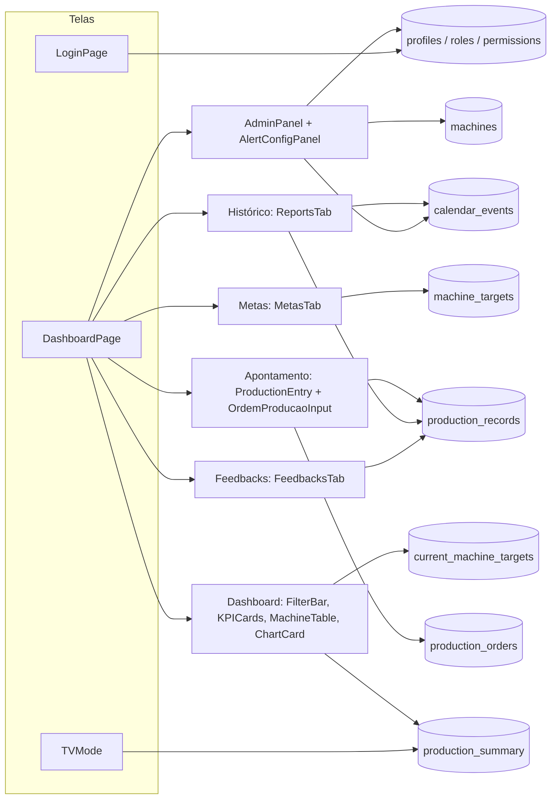

# UI Technical Specification — Dash de Produção WEG

> Versão: `0.1.0` · Data: 22/09/2026 · Idioma: pt-BR (código, tokens e componentes em inglês)
> Onde o código mora: `src/index.css` (tokens), `tailwind.config.ts` (classes), `src/components/ui/` (base), `src/components/` (domínio), `src/lib/status.ts` e `src/lib/chart-theme.ts` (status e gráficos).

Este documento explica **como a interface é construída e por quê**. Foi escrito para quem está começando: cada decisão vem com o motivo.

---

## 1. Visão geral

O Dash de Produção é um painel de chão de fábrica. Ele é usado em três lugares, e cada um tem uma exigência diferente:

| Onde | Quem usa | O que precisa |
|---|---|---|
| Desktop | Técnicos, gestores | Muita informação na tela, tabelas densas, filtros rápidos |
| Celular (≥ 375 px) | Operadores, preparadores | Apontar produção com o dedo, alvos de toque grandes |
| TV (1920 px) | Todos, de longe | Números enormes, alto contraste, **sempre no tema escuro** |

**Identidade:** o azul WEG (`207 100% 35%`) é a cor da marca. O navy WEG (`210 100% 20%`) é o header e a base do tema escuro. O visual é industrial e sóbrio: superfícies em camadas separadas por bordas de 1 px, pouca sombra, hierarquia feita por cor (e não por negrito).

**Temas:** existem claro e escuro. No desktop e no celular, a pessoa alterna pelo botão no header (claro → escuro → sistema). O Modo TV e o Onboarding são sempre escuros.

---

## 2. Princípios de design

1. **O número certo aparece na hora.** Números nunca "contam" animados e a troca de aba é instantânea. *Por quê:* na fábrica a pessoa olha de relance, e uma animação no meio do caminho mostra um valor errado por alguns milissegundos.
2. **Cor nunca é a única informação.** Todo status tem cor **e** rótulo ("Crítico", "Atenção", "Próximo", "Atingido"). *Por quê:* cerca de 8% dos homens têm alguma forma de daltonismo, e TVs antigas distorcem cores.
3. **Uma escala de status só.** A mesma régua (70/90/100%) vale para chips, barras, heatmap e TV. *Por quê:* antes havia 3 regras diferentes, e 77% aparecia vermelho num lugar e amarelo em outro.
4. **Verde e vermelho são reservados a status.** Categorias (turnos, séries de gráfico) usam a escala de azuis WEG. *Por quê:* se o Turno 2 é verde, a pessoa acha que ele "está bom".
5. **Borda para estrutura, sombra só para o que flutua.** Cards têm borda de 1 px e nenhuma sombra. Só popovers e modais têm sombra. *Por quê:* no tema escuro a sombra quase não aparece, e muitas sombras juntas deixam a tela "suja".
6. **Hierarquia por cor, não por peso.** Os pesos vão de 400 a 600. O que é secundário fica em `muted-foreground`. *Por quê:* negrito 800/900 em tudo cria gritaria visual (referência: CRM escuro).
7. **Nenhum valor mágico.** Toda cor, raio, sombra e duração vem de um token. *Por quê:* é o que permite existir tema escuro. Uma cor fixa (`#003366`) não muda quando o tema muda.
8. **Movimento com propósito e curto.** Nada passa de 300 ms. Tudo respeita `prefers-reduced-motion`.

---

## 3. Arquitetura da interface

### 3.1 Mapa de telas → componentes → entidades do banco

As entidades seguem `docs/database/02-referencia-tecnica.md`. **Observação:** hoje o front ainda lê os dados pelo Apps Script (`src/lib/api.ts`). A coluna "Entidade" mostra para onde cada tela aponta no schema Supabase.



| Tela / aba | Componentes | Entidades (schema) | Quem vê (perfil) |
|---|---|---|---|
| Login | `LoginPage`, `ThemeToggle` | `profiles` (`status` pending/active/blocked), `roles` | Todos |
| Apontamento | `ProductionEntry`, `OrdemProducaoInput` | `production_records` (`production_date`, `shift_id`, `machine_id`, `operator_count`), `production_orders` (`order_number`, `quantity`, `is_rework`) | Operador+ |
| Dashboard · Resumo | `FilterBar`, `KPICards`, `RankList`, `MachineTable` / `MobileDetailCards`, `StatusChip`, `SegmentedBar`, `Sparkline` | `production_summary` (`good_quantity`, `rework_quantity`, `total_quantity`, `adjusted_target`), `current_machine_targets` | Técnico+ |
| Dashboard · Detalhado | tabela por máquina, chips de OP | `production_records`, `production_orders` | Técnico+ |
| Dashboard · Turnos | tabela com barra de divisão | `production_records.shift_id`, `shifts` | Técnico+ |
| Dashboard · Gráficos | `ChartCard`, `ChartFullscreen` | `production_summary` | Técnico+ |
| Histórico | `ReportsTab` (calendário e tabela) | `production_records`, `calendar_events` (`holiday`/`special_event`/`excluded_day`) | Preparador+ |
| Metas | `MetasTab` | `machine_targets` (`quantity_per_shift`, `valid_from`), `shifts.is_active` | Técnico (ver) / Gestor (editar) |
| Feedbacks | `FeedbacksTab` | `production_records.notes` | Preparador+ |
| Admin | `AdminPanel` (Dialog), `AlertConfigPanel` | `profiles`, `roles`, `user_permissions`, `machines` (`status`), `calendar_events` | Gestor / Admin |
| Modo TV | `TVMode` | `production_summary` (somente leitura) | Técnico+ / conta `display` |

### 3.2 Pendências (a UI precisaria de algo que o banco ainda não entrega)

Nenhum campo foi inventado. O que a interface gostaria de mostrar e ainda não pode:

| Desejo da UI | Situação no banco | Proposta |
|---|---|---|
| KPI de **OEE** real | `machine_downtimes` existe, mas "criada sem uso — integração SFM futura" | Até lá o KPI se chama **"Atingimento da meta"** (antes estava rotulado "OEE Global", o que era incorreto) |
| Chip de **status da máquina** (ativa/manutenção/preventiva) | `machines.status` existe no schema, mas o front ainda lê do Apps Script | Criar `MachineStatusChip` quando a leitura migrar para o Supabase |
| Mostrar **lotação** ("1 de 2 operadores") | `production_records.operator_count` e `machines.standard_operator_count` existem, mas o Apps Script não envia | Coluna na `MachineTable` quando migrar |
| Separar **produção boa × retrabalho** nos KPIs | `production_summary.good_quantity / rework_quantity` existem | Hoje `producao` soma tudo; o gráfico de retrabalho já separa pelas OPs |
| Faixas de status no **PDF exportado** | `utils/exportPDF.ts` usa `pctColor` de `api.ts` (faixas antigas 80/100) | Migrar o PDF para `STATUS_THRESHOLDS` (fora do escopo: `api.ts` protegido) |

---

## 4. Design tokens

Os tokens são variáveis CSS em `src/index.css` (formato HSL sem `hsl()`) e viram classes no `tailwind.config.ts`. **Regra:** no código, use a classe (`bg-card`, `text-muted-foreground`), nunca a cor.

### 4.1 Cores

**Escala da marca** (`--weg-50` … `--weg-950`). O **600 é o azul WEG** e o **900 é o navy WEG**.

| Token | HSL | Uso típico |
|---|---|---|
| `--weg-50` | 207 100% 97% | fundos bem suaves |
| `--weg-200` | 207 90% 84% | série 2 de gráfico (escuro) |
| `--weg-300` | 207 85% 70% | texto azul no tema escuro (`--brand-text`) |
| `--weg-400` | 207 85% 56% | série 1 de gráfico (escuro), foco |
| `--weg-600` | 207 100% 35% | **azul WEG**: botão primário, série 1 (claro) |
| `--weg-700` | 208 100% 29% | hover do botão primário |
| `--weg-900` | 210 100% 20% | **navy WEG**: header, fundo do login |
| `--weg-950` | 213 50% 8% | base do tema escuro, overlays |

*Por que uma escala e não só duas cores:* para ter tons de fundo, hover e texto que "combinam" entre si sem inventar hex novos.

**Superfícies e texto**

| Token | Claro | Escuro | Por quê |
|---|---|---|---|
| `--background` | 220 20% 97% | 213 50% 5% | O escuro nasce do navy WEG, e não de um cinza neutro |
| `--card` | 0 0% 100% | 213 40% 9% | 1º nível de superfície |
| `--surface-2` | 220 20% 98% | 213 34% 12% | 2º nível: rodapé de tabela, linha expandida |
| `--foreground` | 213 40% 10% | 210 35% 94% | Texto principal (≥ 15:1) |
| `--muted-foreground` | 213 12% 40% | 212 14% 62% | Rótulos (≥ 5,5:1: passa no AA) |
| `--border` | 220 14% 90% | 213 30% 17% | Divisões de 1 px |
| `--input` | 215 12% 58% | 213 18% 42% | Borda de campos (≥ 3:1, WCAG 1.4.11) |
| `--brand-text` | = weg-600 | = weg-300 | Texto azul (links, sparkline). No escuro o azul WEG puro teria contraste baixo |
| `--primary` | = weg-600 | = weg-600 | Botão primário: a assinatura da marca não muda |

**Status** (sempre acompanhados de rótulo)

| Status | Faixa | Token | Claro | Escuro |
|---|---|---|---|---|
| Crítico | < 70% | `--destructive` | 0 72% 44% | 0 80% 64% |
| Atenção | 70–89% | `--warning` | 30 100% 30% | 38 92% 56% |
| Próximo | 90–99% | `--info` | = weg-600 | = weg-300 |
| Atingido | ≥ 100% | `--success` | 142 70% 26% | 145 58% 50% |

*Por que os tons mudam por tema:* o texto do chip precisa de 4,5:1 sobre o card. No claro, as cores precisam ser escuras; no escuro, precisam ser claras.

**Gráficos:** `--chart-1..4` (azuis WEG + neutro), `--chart-grid` e `--chart-reference` (a linha tracejada de meta).

### 4.2 Tipografia

Fonte **Geist** (Vercel, licença OFL), instalada pelo npm (`@fontsource-variable/geist`), sem depender do Google Fonts. Números usam `tabular-nums`, com todos os dígitos da mesma largura.

| Classe | Tamanho / altura | Uso |
|---|---|---|
| `text-caption` | 11/16 px | **Mínimo absoluto.** Rodapés, metadados |
| `text-xs` | 12/16 px | Cabeçalho de tabela, chips, subtítulos |
| `text-sm` | 14/20 px | Corpo, células, títulos de card |
| `text-base` | 16/24 px | KPIs secundários |
| `text-kpi` | 24/28 px | Número principal do KPI |
| `text-tv-label` / `text-tv-kpi` | 20 px / 56 px | Modo TV (leitura a 3–5 m) |

Pesos: **400** (texto), **500** (títulos, valores de tabela), **600** (números de destaque). *Por que Geist:* é neutra, técnica e legível em 11–13 px. Foi escolhida por você a partir da referência.

### 4.3 Espaçamentos

Escala de **4 px** do Tailwind: `1`=4 · `2`=8 · `3`=12 · `4`=16 · `5`=20 · `6`=24 · `8`=32. Linha de tabela: **36 px** (`h-9`). Alvo de toque no celular: **44 px** (`h-11` / `min-h-11`). *Por quê:* uma escala única deixa as distâncias previsíveis. 44 px é o mínimo recomendado para o dedo.

### 4.4 Border radius

| Token | Valor | Uso |
|---|---|---|
| `rounded-sm` (`--radius-sm`) | 4 px | chips, barras, segmentos |
| `rounded-md` (`--radius-md`) | 6 px | botões, inputs, pílulas de filtro |
| `rounded-lg` (`--radius`) | 10 px | cards, tabelas |
| `rounded-xl` (`--radius-xl`) | 14 px | modais, sheets |

**Regra concêntrica:** raio de fora = raio de dentro + espaçamento (ex.: botão de 6 px dentro de um card com 4 px de folga → card de 10 px). *Por quê:* raios desencontrados são o detalhe que mais faz uma tela parecer "torta".

### 4.5 Sombras

| Token | Uso |
|---|---|
| (nenhuma) | cards, tabelas, KPIs: usam só borda |
| `shadow-popover` | dropdowns, popovers, tooltips |
| `shadow-modal` | modais, sheets, barra flutuante de salvar |

No escuro, as sombras ganham um anel de 1 px (`0 0 0 1px var(--border)`), porque sombra preta sobre fundo preto não aparece.

### 4.6 Breakpoints

`sm` 640 · `md` 768 · `lg` 1024 · `xl` 1280 · `2xl` 1536 · **`tv` 1920**. O `useIsMobile()` usa < 768 px.

### 4.7 Motion

Durações e curvas medidas nos vídeos de referência (seção 15):

| Token | Valor | Uso |
|---|---|---|
| `--duration-press` | 100 ms | `scale(0.96)` ao pressionar |
| `--duration-fast` | 150 ms | hover, troca de cor |
| `--duration-base` | 200 ms | popover, dropdown, chevron |
| `--duration-slow` | 250 ms | modal, sheet |
| `--ease-out` | `cubic-bezier(0.23, 1, 0.32, 1)` | entradas |
| `--ease-in-out` | `cubic-bezier(0.77, 0, 0.175, 1)` | movimento na tela |
| `--ease-drawer` | `cubic-bezier(0.32, 0.72, 0, 1)` | sheet / gaveta |

Classes: `duration-fast`, `ease-out`, `press` (utilitário de scale ao pressionar).

---

## 5. Componentes

### Buttons — `src/components/ui/button.tsx`
Variantes (`cva`): `default` (azul WEG preenchido, **um por tela**), `outline`, `secondary`, `ghost`, `destructive`, `link`. Tamanhos: `sm` 32 px, `default` 36 px, `lg` 44 px, `icon` 36×36. Ao pressionar: `scale(0.96)` (desligado em reduced motion). *Por que um só primário:* o olho encontra a ação principal sem pensar (referência do CRM: o único botão preenchido é o "New Company").

### Inputs — `ui/input.tsx`, `DatePickerInput`, `SelectDropdown`
Altura de 36 px (44 px no login), borda `--input` (3:1) e foco com anel `--ring`. `DatePickerInput` e `SelectDropdown` têm `variant="field"` (rótulo em cima, para formulários) e `variant="pill"` (rótulo apagado dentro da pílula, para filtros).

### Cards — `ui/card.tsx`
`rounded-lg border bg-card`, sem sombra, padding de 16 px. Título em `text-sm font-medium` e descrição em `text-xs text-muted-foreground`.

### Modals — `ui/dialog.tsx`, `ui/sheet.tsx`
Radix Dialog: **Esc fecha, o foco fica preso dentro e o fundo fica inerte**. `rounded-xl`, `shadow-modal`, 250 ms com `ease-out`, `scale(0.96)` + fade. O `AdminPanel` passou a usar Dialog (antes não fechava com Esc).

### Tables — `ui/table.tsx`, `MachineTable`
Linhas de 36 px, cabeçalho `text-xs` apagado, números alinhados à direita com `tabular-nums`, hover `surface-2`, linha selecionada `bg-weg-600/10`, rodapé com agregados ("6 máquinas · 174 registros", "Soma", %).

### Navigation — `WEGHeader`, abas, `BottomNav`
- Header sempre navy WEG (a marca), com botões ghost brancos e `ThemeToggle`.
- Abas principais em **texto simples com sublinhado** (referência). As sub-visões usam controle segmentado.
- `BottomNav` no celular: 5 destinos, 64 px de altura, `aria-current="page"` e rótulos de 11 px.

### Chips / Badges — `ui/badge.tsx`, `StatusChip`
Fundo translúcido da cor (10%) + texto na mesma cor + borda sutil (30%). Variantes: `success`, `warning`, `destructive`, `info`, `neutral`. `StatusChip pct={49}` → "● Crítico". Com `emptyLabel`, mostra "Sem apontamento" quando não há dado.

### Charts / Sparklines — `ChartCard`, `lib/chart-options.ts`, `lib/chart-theme.ts`, `Sparkline`, `SegmentedBar`
- O ECharts desenha em canvas e não entende `var(--x)`. Por isso `useChartTheme()` lê os tokens já resolvidos e refaz os gráficos quando o tema muda.
- `SegmentedBar`: 10 segmentos pintados com a cor do status, sempre com o % ao lado.
- `Sparkline`: barras dos últimos 14 dias apontados (% da meta/dia), com a última barra destacada.

### KPI — `KPICards`
Uma faixa com divisórias de 1 px: **4 KPIs principais** (Produção com variação, Atingimento com chip, Taxa de apontamento, Máquinas ativas) e **4 secundários**, menores. A variação usa seta + sinal + texto ("↑ +12% vs período anterior").

---

## 6. Estados dos componentes

| Componente | Default | Hover | Focus | Active | Disabled | Loading | Error | Empty |
|---|---|---|---|---|---|---|---|---|
| Button | cor da variante | tom mais escuro (`weg-700`) / `bg-accent` | anel `ring` 2 px + offset | `scale(0.96)` | opacidade 50%, sem clique | ícone `Loader2` girando + "Aguarde…" | — | — |
| Input | borda `input` | — | anel `ring/40` + borda `ring` | — | opacidade 50% | — | alerta `role="alert"` abaixo, cor `destructive` | placeholder com exemplo real |
| Pílula de filtro | `bg-card` + rótulo apagado | `bg-accent` | anel `ring` | `scale(0.96)`; aberta = `bg-accent` | — | — | — | "Todas" / "Todos" |
| Card | borda 1 px | — | — | — | — | skeleton do mesmo tamanho | — | texto + ação |
| Table row | `bg-card` | `bg-surface-2` | botão de expandir com anel | expandida: `bg-weg-600/10` | — | skeleton de linhas de 36 px | — | "Nenhuma máquina no filtro atual." |
| StatusChip | cor do status + rótulo | — | — | — | — | — | — | "Sem meta" / "Sem apontamento" |
| ChartCard | título + gráfico | tooltip ~150 ms | "Expandir" com anel | — | — | skeleton do tamanho do gráfico | — | ícone + "Nenhum apontamento no período" + dica |
| Dialog | centralizado, `shadow-modal` | — | foco no 1º elemento, preso | — | — | — | toast (`sonner`) | — |
| KPI | valor + rodapé | — | — | — | — | skeleton 4 colunas `aria-busy` | — | "—" + motivo ("mín. 30 dias p/ comparar") |

---

## 7. Layout e responsividade

- **Desktop (≥ 768 px):** largura máxima de 1400 px, gutter de 16 px. Barra de abas em texto, pílulas de filtro à esquerda e controle de visão à direita. KPIs em 4 colunas, gráficos em 2 colunas.
- **Celular (375 px):** `BottomNav` fixa; o conteúdo tem `pb-24` para a barra não cobrir nada. Filtros dentro de uma caixa recolhível com o resumo em uma linha. KPIs em 2 colunas. A tabela vira lista densa com divisórias (`MobileDetailCards`). **Sem rolagem horizontal** (verificado: `scrollWidth = 375`).
- **TV (1920 px):** tela cheia, sempre `.dark`, textos ≥ 16 px, números de 48–56 px, rótulos de status escritos e rotação automática de slides a cada 8 s, com barra de progresso.

---

## 8. Acessibilidade

- **Contraste (medido, WCAG 2.x):** todos os pares de texto passam no AA (≥ 4,5:1) nos dois temas; bordas de input ≥ 3:1. O script que mede fica fora do repositório; os valores estão na seção 4.1.
- **Foco visível:** `:focus-visible` com contorno de 2 px em `--ring` no app todo.
- **Teclado:** Dialogs fecham com Esc e prendem o foco. `ChartFullscreen` fecha com Esc. Abas com `role="tab"` e `aria-selected`.
- **ARIA:** `aria-label` em botões só com ícone (header no celular, olho da senha, expandir linha); `aria-expanded` em linhas e filtros recolhíveis; `role="img"` + `aria-label` em barras e sparklines; `aria-busy` nos skeletons; alertas de login com `role="alert"`.
- **Reduced motion:** o CSS global corta animações; `MotionConfig reducedMotion="user"` cobre o framer-motion; o ECharts desliga a animação; o `press` não escala.
- **Cor nunca sozinha:** status com rótulo, variação com seta e sinal, retrabalho com a palavra "Retrabalho", turnos com legenda.

---

## 9. Interações e comportamento

| Situação | Anima? | Como |
|---|---|---|
| Troca de aba / sub-visão | **Não** | Instantâneo. É ação frequente, e animar atrasa a leitura |
| Hover de botão, linha, pílula | Sim, só cor | 150 ms `ease-out` |
| Pressionar botão | Sim | `scale(0.96)` em 100 ms |
| Abrir dropdown / popover | Sim | 200 ms, fade + escala a partir do gatilho |
| Abrir modal / sheet | Sim | 250 ms `ease-out` / `ease-drawer` |
| Gráficos ao carregar | Sim, curto | 250 ms `cubicOut`; desligado em reduced motion |
| Números dos KPIs | **Não** | O valor certo aparece direto |
| Trocar tema | **Não** | `disableTransitionOnChange` evita o "borrão" de todas as cores juntas |
| Slide da TV | Sim | Fade curto; barra de progresso linear (`transform`) |

Regra: **ease-out** para entradas; nunca `ease-in`; nunca `transition: all`; animar só `transform` e `opacity`.

---

## 10. Padrões de implementação

- **Tokens:** `src/index.css` (`:root` e `.dark`). Classes: `tailwind.config.ts`.
- **Variantes:** `cva` em `ui/button.tsx` e `ui/badge.tsx`. Crie variantes em vez de sobrescrever classes em cada uso.
- **Status:** `src/lib/status.ts`, com `getAttainmentStatus`, `STATUS_LABEL`, `STATUS_TOKEN`, `STATUS_BG_CLASS`, `statusStyle(pct)` e `withAlpha(cor, a)`.
- **Gráficos:** `src/lib/chart-options.ts` (`chartBase`, `axisStyle`, `legendStyle` + builders) e `src/lib/chart-theme.ts` (`useChartTheme`, `readChartTheme(scope)`, `statusColor`).
- **Tema:** `next-themes` em `App.tsx` (`attribute="class"`), com `ThemeToggle`. Para uma área sempre escura, coloque `className="dark"` no container (como `TVMode` e `OnboardingPresentation`).
- **Estilo inline:** só quando o valor é dinâmico (largura de barra em %). A cor vem de `hsl(var(--token))`, nunca de hex.

---

## 11. Boas práticas para desenvolvimento

1. Antes de escrever uma cor, procure o token. Se não existir, crie **no `index.css`**, nos dois temas.
2. Teste sempre no claro, no escuro e em 375 px.
3. Status = `StatusChip` (ou `statusStyle`). Não recrie a regra de faixas.
4. Número em tabela: alinhado à direita e com `tabular-nums`.
5. Estado vazio sempre explica o que fazer ("Ajuste as datas…").
6. Skeleton com o mesmo formato do conteúdo final.
7. Não mude regras de negócio nem `src/lib/api.ts` em PRs de UI.

---

## 12. Exemplos de uso

```tsx
// Chip de status com rótulo (src/components/StatusChip.tsx)
<StatusChip pct={m.pct} />
<StatusChip pct={null} emptyLabel="Sem apontamento" />
```

```tsx
// Célula de atingimento da MachineTable
<div className="flex items-center gap-2">
  <SegmentedBar pct={m.pct} className="w-20 shrink-0" />
  <span className="w-10 text-right">{m.pct}%</span>
  <StatusChip pct={m.pct} />
</div>
```

```tsx
// Filtro em pílula (FilterBar)
<SelectDropdown variant="pill" label="Máquina" value={machine} onChange={setMachine}
  options={[{ value: "TODAS", label: "Todas" }, ...machines.map(m => ({ value: m.name, label: m.name }))]} />
```

```tsx
// Gráfico que acompanha o tema (DashboardPage)
const ct = useChartTheme();
const barOption = useMemo(() => getBarChartOption(barData, isMobile, ct), [barData, isMobile, ct]);
<ChartCard title="Produção vs meta por máquina" option={barOption} onExpand={() => setFullscreenChart("bar")} />
```

```tsx
// Botões: um primário por tela, o resto outline/ghost
<Button>Salvar metas</Button>
<Button variant="outline" size="sm"><FileText aria-hidden="true" />Exportar</Button>
```

```tsx
// Área sempre escura (TVMode)
<div ref={containerRef} className="dark bg-background font-sans text-foreground">…</div>
```

---

## 13. Do / Don't

| Do ✅ | Don't ❌ | Por quê |
|---|---|---|
| `className="bg-card text-muted-foreground"` | `style={{ background: "#fff", color: "#475569" }}` | Hex fixo não muda no tema escuro |
| `<StatusChip pct={pct} />` | `<span style={{ color: pct >= 100 ? "#22C55E" : "#EF4444" }}>` | Regra duplicada e cor sem rótulo |
| `rounded-lg border bg-card` | `rounded-xl shadow-md style={{ borderRadius: 12 }}` | Raio e sombra fora dos tokens |
| `transition-colors duration-fast` | `transition-all duration-300` | `all` anima coisa demais e o tempo foge do padrão |
| Turnos em `chart-1/2/3` (azuis) | Turno 2 em verde | Verde significa "bom" |
| `text-xs text-muted-foreground` para rótulo | `text-[10px] font-bold uppercase tracking-wider` | Pequeno demais e hierarquia por peso |
| `withAlpha(cor, 0.14)` | `` `${cor}22` `` | Concatenar hex quebra com tokens |
| Dialog do Radix | `div fixed inset-0` feito à mão | Sem Esc, sem foco preso |

---

## 14. Checklist para PRs de UI

- [ ] Nenhum hex, `rgba()` ou `text-[Npx]` novo fora de `index.css`
- [ ] Testado no claro, no escuro e em 375 px (sem rolagem horizontal)
- [ ] Status com rótulo (não só cor)
- [ ] Um único botão primário por tela
- [ ] Hover, focus, disabled, loading e empty definidos
- [ ] Botões só com ícone têm `aria-label`
- [ ] Animações ≤ 300 ms, só `transform`/`opacity`, respeitam reduced motion
- [ ] Contraste AA conferido para cores novas
- [ ] `npm run build`, `npm run lint` e `npm test` sem erros novos
- [ ] Sem mudança em regra de negócio nem em `src/lib/api.ts`

---

## 15. Referências / Figma

Não há arquivo Figma. As referências abaixo foram analisadas; nenhuma marca ou cor delas foi copiada.

| Referência | Adotado | Adaptado à WEG | Descartado |
|---|---|---|---|
| **Imagem: CRM escuro com tabela, chips e sparklines** (anexada na conversa; página: uitopic.com/design/dark-crm-table-with-tag-chips-and-sparklines, cujo conteúdo não é acessível em texto) | Superfícies em camadas com borda de 1 px; tabela densa de 36 px; cabeçalho apagado; números à direita; chips translúcidos; barra segmentada de probabilidade; sparkline de barras; rodapé com agregados; pílulas "rótulo · valor"; abas em texto; um único botão primário | Roxo → azul WEG; fundo escuro derivado do navy WEG; barra segmentada = % da meta; sparkline = % da meta/dia; chips = escala de status | Sidebar com pipelines/contadores (o app usa abas, não sidebar); avatares; checkbox por linha (não há ação em lote na tabela) |
| **Imagem: dashboard de marketing** (anexada; mesma família do vídeo 1) | Faixa única de KPIs com divisórias e variação "↑ x% vs…"; cards de título + subtítulo + número + gráfico de área; "valor / meta" com barra fina; barras horizontais em pares; família Geist | KPIs de produção; "Maiores atingimentos / Precisam de atenção" no formato "Marketing goals"; turnos T1×T2 em azuis | Funil de pipeline (não existe funil na produção); cápsulas "Revenue vs target" (ficaram só no mockup) |
| **Vídeo 1** (14 s, dashboard de marketing) | Skeleton que dá lugar ao conteúdo com fade de ~200–300 ms; tooltip de ~150 ms `ease-out`; destaque do item focado (os outros esmaecem) | Skeletons com o formato final; tooltips via tokens | Qualquer efeito decorativo |
| **Vídeo 2** (49 s, o CRM da referência) | Dropdown de filtro a partir do gatilho em ~150–200 ms `ease-out`; modal com escala 0.96 + fade + fundo esmaecido em ~200 ms; painel lateral de ~250 ms com curva de gaveta | `--duration-base/slow`, `--ease-out`, `--ease-drawer`; Dialog do Admin e ExportModal | Busca ⌘K e painel lateral de detalhe (ficam como ideias futuras) |
| **Vídeo 3** (14 s, kanban; página uitopic.com/design/love-this-kanban) | Densidade dos cards; hover discreto; reorganização ~200 ms `ease-in-out` | Densidade aplicada a `MobileDetailCards`/`MachineCardMobile` | Arrastar e soltar (não faz parte do fluxo de apontamento) |
| **x.com/marcelkargul/status/2099447410804035806** | — | — | **Não acessado:** o X exige login (HTTP 402). Se for importante, envie um print |
| **Skills `emil-design-eng` e `better-ui`** | Escala 0.96 ao pressionar; nada de `transition: all`; `ease-out` para entradas; nada > 300 ms; raios concêntricos; borda para estrutura e sombra para elevação; sem transição na troca de tema; troca de aba sem animação | — | — |
